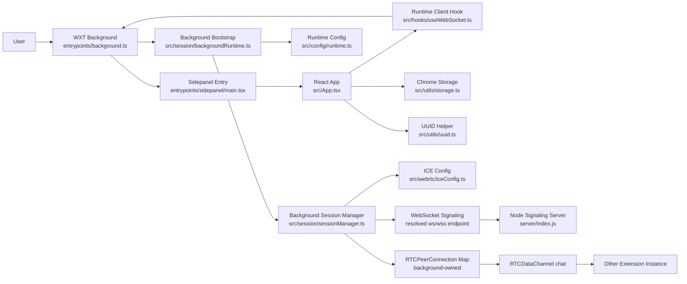
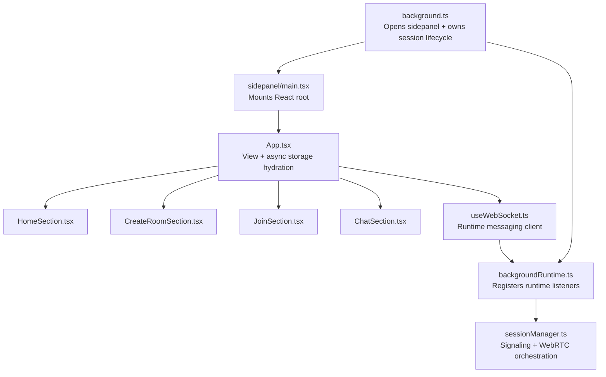
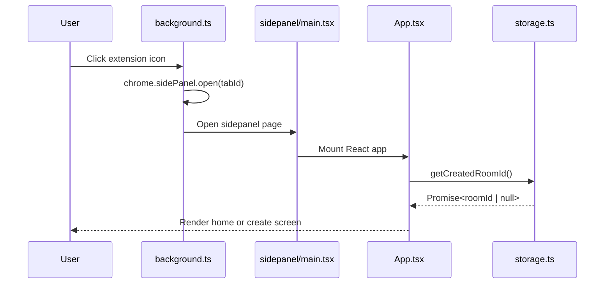
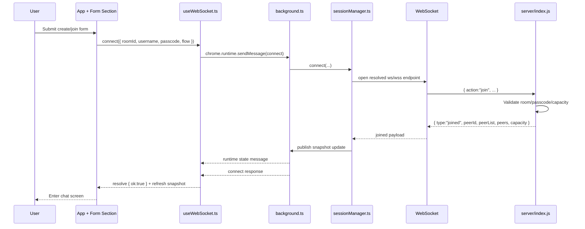
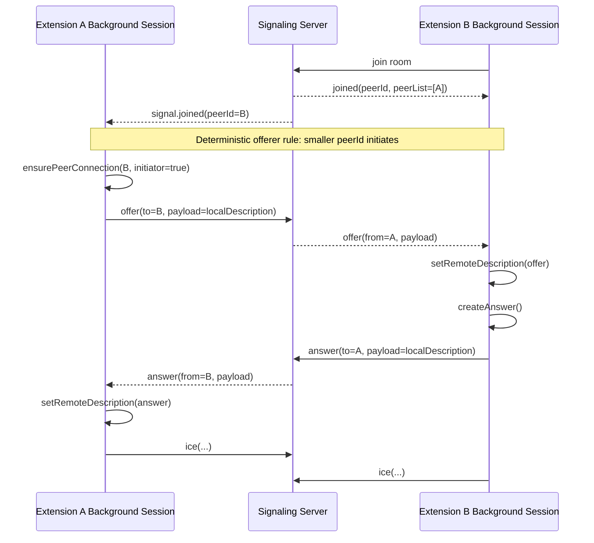
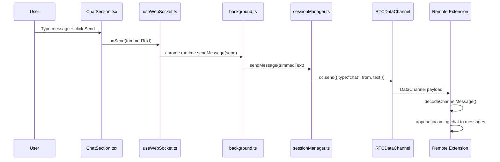
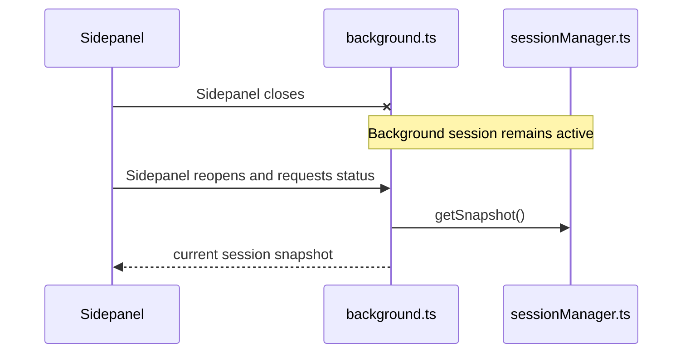
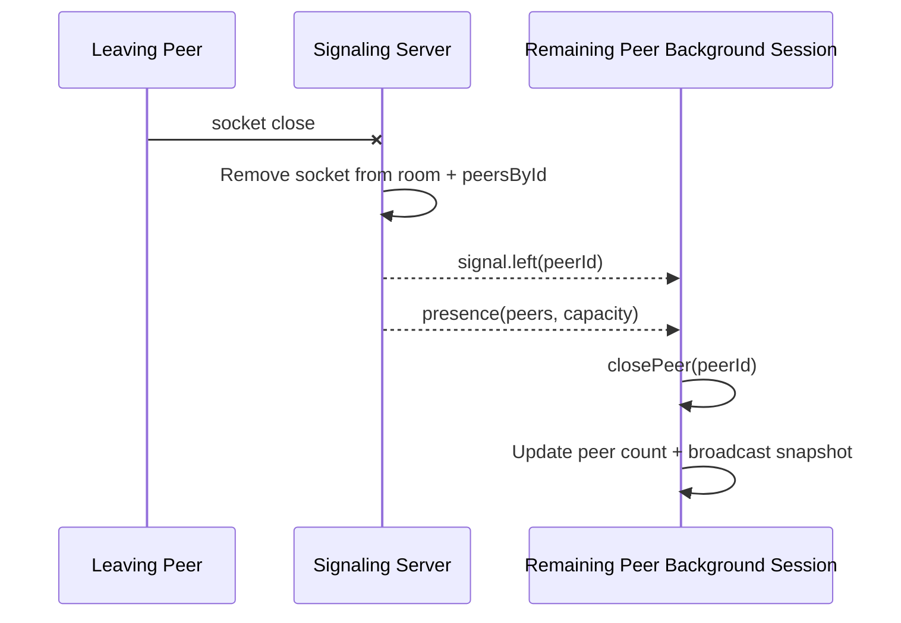

# Peer Bridge Architecture

This document explains how the extension, signaling server, and WebRTC layer fit
together, and what objects/components are involved in each major behavior.

## High-Level Architecture

## Extension Runtime Structure

In this document, `bootstrap` means the background runtime setup layer: the code
that wires Chrome extension events and messaging to the session controller during startup.

## Core Objects

| Object / State | Location | Responsibility |
| --- | --- | --- |
| `view` | `src/App.tsx` | Chooses `home/create/join/chat` screen |
| `createdRoomId` | `src/App.tsx` | Async persisted owner room id used to restore create flow |
| `sessionRef` | `src/App.tsx` | Tracks latest UI-visible room state for disconnect cleanup |
| `snapshot` | `src/hooks/useWebSocket.ts` | Sidepanel copy of background session state |
| `setupBackgroundRuntime` | `src/session/backgroundRuntime.ts` | Wires Chrome runtime events and messaging to the background session controller |
| `socket` | `src/session/sessionManager.ts` | Active signaling WebSocket owned by background |
| `peerId` | `src/session/sessionManager.ts` | Local peer id assigned by server |
| `peers` | `src/session/sessionManager.ts` | `Map<peerId, { pc, dc }>` for all remote peers |
| `messages` | `src/session/sessionManager.ts` | Chat timeline broadcast back to the sidepanel |
| `resolveSignalingEndpoint` | `src/config/runtime.ts` | Resolves env-backed websocket endpoint |
| `rooms` | `server/index.js` | Server-side room registry |
| `peersById` | `server/index.js` | Server-side lookup from `peerId` to socket |

## Control Plane vs Data Plane

Peer Bridge intentionally splits responsibilities into two layers:

### Control Plane: signaling server

The signaling server remains responsible for session coordination:

- Room create/join validation
- Passcode enforcement
- Username uniqueness
- Capacity limits
- `peerId` assignment
- Presence updates
- `offer` / `answer` / `ice` relay
- Peer join/leave notifications

This is the part that answers:

- Who is in the room?
- Is this join allowed?
- Which peer should I negotiate with?
- How do I reach the remote peer's signaling endpoint?

### Data Plane: peer-to-peer WebRTC

Once negotiation succeeds, the peers talk directly over WebRTC:

- Chat text over `RTCDataChannel`
- Future audio/video media tracks
- Future peer-to-peer collaborative events

This is the part that answers:

- What message did the user send?
- What media/data should the other peer receive?

### Why not move room management to peers too?

That is possible only in a very constrained model. In practice, it breaks down
once any of these happen:

- A new peer joins after the first connection is established
- A peer refreshes or reconnects
- Network conditions change and renegotiation is needed
- Permissions, room access, or capacity must be enforced consistently

Because of that, Peer Bridge keeps **room/session orchestration on the server**
while moving **chat/media payloads off the server**.

### Design Summary

- Signaling server manages the **control plane**
- WebRTC peers manage the **data plane**
- Chat should be peer-to-peer
- Session coordination should remain centralized

## Flow: Open Extension To Sidepanel UI

## Flow: Create Or Join A Room

## Flow: Peer Discovery And WebRTC Negotiation

## Flow: Send Chat Message

## Flow: Sidepanel Close/Reopen

## Flow: Disconnect / Peer Leave

## Behavior Mapping

| Behavior | Main Files Visited |
| --- | --- |
| Open sidepanel | `entrypoints/background.ts` -> `entrypoints/sidepanel/main.tsx` -> `src/App.tsx` |
| Create room | `CreateRoomSection.tsx` -> `App.tsx` -> `useWebSocket.ts` -> `background.ts` -> `backgroundRuntime.ts` -> `sessionManager.ts` -> `server/index.js` |
| Join room | `JoinSection.tsx` -> `App.tsx` -> `useWebSocket.ts` -> `background.ts` -> `backgroundRuntime.ts` -> `sessionManager.ts` -> `server/index.js` |
| Background bootstrap | `entrypoints/background.ts` -> `session/backgroundRuntime.ts` |
| Signaling relay | `sessionManager.ts` -> `server/index.js` -> remote `sessionManager.ts` |
| WebRTC setup | `sessionManager.ts` -> `iceConfig.ts` -> browser `RTCPeerConnection` |
| Chat send | `ChatSection.tsx` -> `useWebSocket.ts` -> `background.ts` -> `backgroundRuntime.ts` -> `sessionManager.ts` -> `RTCDataChannel` |
| Created-room persistence | `App.tsx` -> `utils/storage.ts` -> `chrome.storage.local` |
| Sidepanel reopen restore | `App.tsx` -> `useWebSocket.ts` -> `background.ts` -> `backgroundRuntime.ts` -> `sessionManager.ts` |

## Related Docs

- [Protocol](./protocol.md)
- [Extension Lifecycle Smoke](./extension-lifecycle-smoke.md)
- [README](../README.md)
