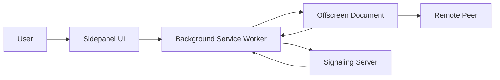
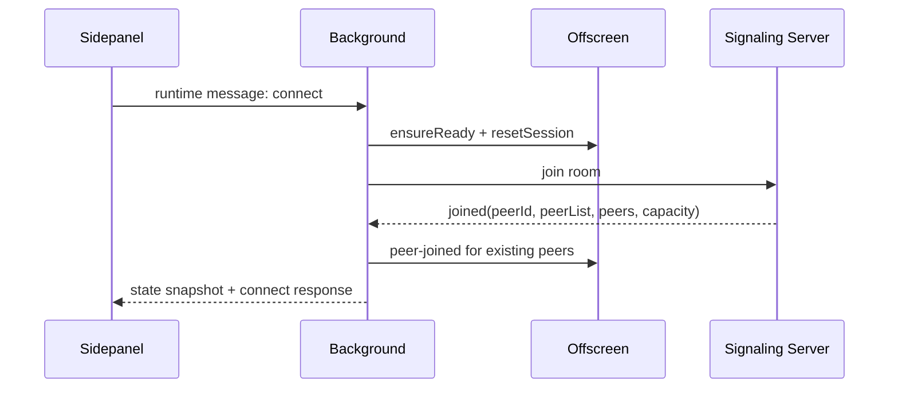
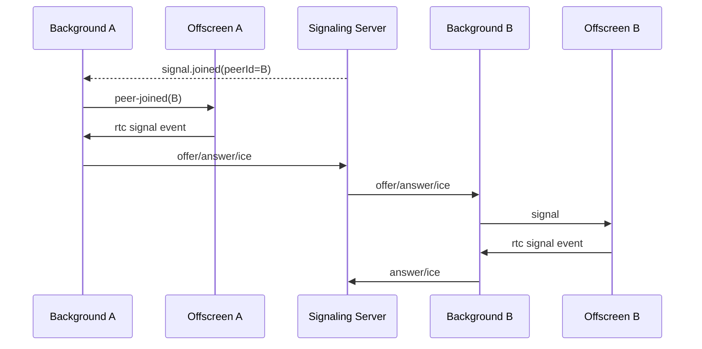
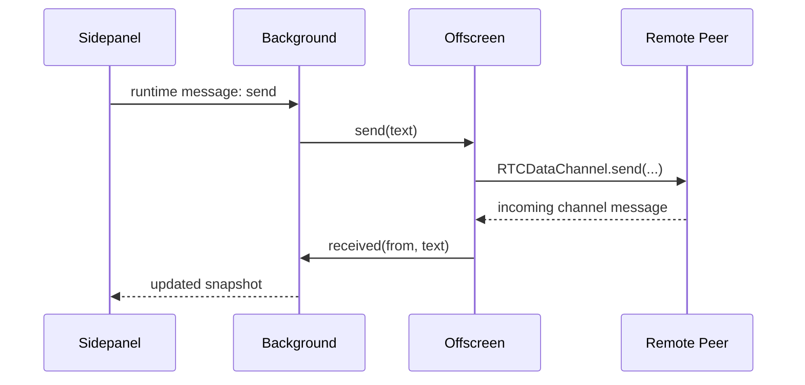

# Peer Bridge Architecture

This document describes the current runtime-based structure of the extension and
how messages move between the sidepanel, background service worker, offscreen
document, and signaling server.

## Runtime Layout

```text
extension/src/
  background/
    messageRouter.ts
    offscreenBridge.ts
    runtime.ts
    sessionManager.ts
  offscreen/
    iceConfig.ts
    main.ts
    rtcPeerManager.ts
  shared/
    rtcProtocol.ts
    runtimeConfig.ts
    session.ts
    sessionTypes.ts
    storage.ts
    uuid.ts
  sidepanel/
    App.tsx
    App.css
    components/
    hooks/
```

## Responsibilities

### `background/`

- Owns the WebSocket connection to the signaling server
- Owns the background session snapshot
- Opens the sidepanel from the toolbar action
- Routes runtime messages from the sidepanel
- Ensures an offscreen document exists before RTC activity starts

Key files:

- [`extension/src/background/runtime.ts`](/Users/crccc/side-projects/webrtc-chat/extension/src/background/runtime.ts)
- [`extension/src/background/messageRouter.ts`](/Users/crccc/side-projects/webrtc-chat/extension/src/background/messageRouter.ts)
- [`extension/src/background/sessionManager.ts`](/Users/crccc/side-projects/webrtc-chat/extension/src/background/sessionManager.ts)
- [`extension/src/background/offscreenBridge.ts`](/Users/crccc/side-projects/webrtc-chat/extension/src/background/offscreenBridge.ts)

### `offscreen/`

- Owns `RTCPeerConnection`
- Owns `RTCDataChannel`
- Applies ICE config
- Sends RTC events back to the background runtime

Key files:

- [`extension/src/offscreen/main.ts`](/Users/crccc/side-projects/webrtc-chat/extension/src/offscreen/main.ts)
- [`extension/src/offscreen/rtcPeerManager.ts`](/Users/crccc/side-projects/webrtc-chat/extension/src/offscreen/rtcPeerManager.ts)
- [`extension/src/offscreen/iceConfig.ts`](/Users/crccc/side-projects/webrtc-chat/extension/src/offscreen/iceConfig.ts)

### `sidepanel/`

- Renders the user-facing UI
- Sends connect, disconnect, send, and status requests to the background runtime
- Mirrors the background snapshot into React state

Key files:

- [`extension/src/sidepanel/App.tsx`](/Users/crccc/side-projects/webrtc-chat/extension/src/sidepanel/App.tsx)
- [`extension/src/sidepanel/hooks/useWebSocket.ts`](/Users/crccc/side-projects/webrtc-chat/extension/src/sidepanel/hooks/useWebSocket.ts)
- [`extension/src/sidepanel/components/CreateRoomSection.tsx`](/Users/crccc/side-projects/webrtc-chat/extension/src/sidepanel/components/CreateRoomSection.tsx)
- [`extension/src/sidepanel/components/JoinSection.tsx`](/Users/crccc/side-projects/webrtc-chat/extension/src/sidepanel/components/JoinSection.tsx)
- [`extension/src/sidepanel/components/ChatSection.tsx`](/Users/crccc/side-projects/webrtc-chat/extension/src/sidepanel/components/ChatSection.tsx)

### `shared/`

- Holds cross-runtime message contracts
- Holds common session helpers and shared type definitions
- Holds runtime config resolution and storage helpers

Key files:

- [`extension/src/shared/rtcProtocol.ts`](/Users/crccc/side-projects/webrtc-chat/extension/src/shared/rtcProtocol.ts)
- [`extension/src/shared/session.ts`](/Users/crccc/side-projects/webrtc-chat/extension/src/shared/session.ts)
- [`extension/src/shared/sessionTypes.ts`](/Users/crccc/side-projects/webrtc-chat/extension/src/shared/sessionTypes.ts)
- [`extension/src/shared/runtimeConfig.ts`](/Users/crccc/side-projects/webrtc-chat/extension/src/shared/runtimeConfig.ts)
- [`extension/src/shared/storage.ts`](/Users/crccc/side-projects/webrtc-chat/extension/src/shared/storage.ts)

## High-Level Flow



## Create or Join Flow



## Signaling and RTC Flow



## Chat Send Flow



## Why Offscreen Exists

Manifest V3 background logic runs in a service worker. Peer Bridge does not keep
`RTCPeerConnection` in that worker. Instead:

- background owns signaling and session orchestration
- offscreen owns the actual RTC session

That split avoids depending on service-worker availability for page-like RTC
behavior and allows the sidepanel UI to close without immediately tearing down
the visible interface.

## Key Entrypoints

- [`extension/entrypoints/background.ts`](/Users/crccc/side-projects/webrtc-chat/extension/entrypoints/background.ts)
- [`extension/entrypoints/sidepanel/main.tsx`](/Users/crccc/side-projects/webrtc-chat/extension/entrypoints/sidepanel/main.tsx)
- [`extension/entrypoints/offscreen.html`](/Users/crccc/side-projects/webrtc-chat/extension/entrypoints/offscreen.html)

## Related Docs

- [README](../README.md)
- [Protocol](./protocol.md)
- [Extension Lifecycle Smoke](./extension-lifecycle-smoke.md)
